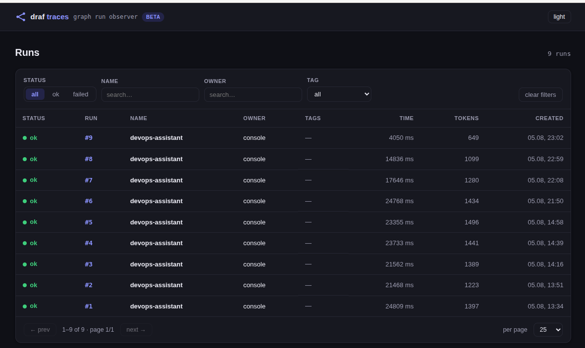
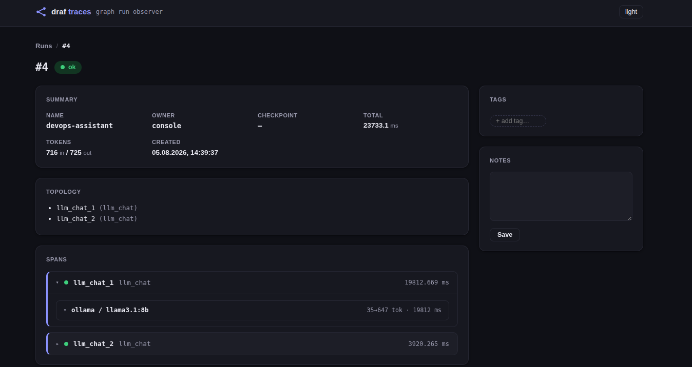

# Observability

See exactly what every LLM call in a run actually did — the full graph, one
span per node, and the **complete request/response** of every model call,
prompt included — in a self-hosted web dashboard. Think "local Langfuse",
but zero extra services to run.



A `GraphObserver` sits between `graph.run()` and an exporter. It captures:

- the **graph topology** (nodes + edges) for visualisation,
- one **span per visited node** (timing, status, errors),
- every **LLM call with its full payload** — the exact `messages` sent to the
  model, the response, tokens, latency, cache hits.

The captured run lands in **SQLite** (browseable in the browser), a JSONL
file, or is **pushed** over HTTP to our collector or to
langfuse / langsmith. Traces never block or crash the workflow.

## Zero-code: the `observability:` block

The easiest path is declarative — a top-level block in `workflow.yaml` that
`draf run` and `draf daemon` pick up automatically:

```yaml
name: my-workflow

observability:
  db: ./data/traces.db            # local SQLite store (our dashboard)
  export:                          # optional: also push to remote sinks
    - type: webhook               # any HTTP endpoint (e.g. our obs-server)
      url: http://obs:8001/obs/ingest
    - type: langfuse              # langfuse public API (Basic auth)
      host: https://cloud.langfuse.com
      public_key_env: LANGFUSE_PUBLIC_KEY
      secret_key_env: LANGFUSE_SECRET_KEY
    - type: langsmith             # langsmith runs API (x-api-key)
      api_key_env: LANGCHAIN_API_KEY
      project: my-project

steps:
  - id: answer
    type: llm_chat
    config: {model: llama3.1:8b, output_key: reply}
```

- `db:` resolves relative to the workflow file; the folder is created if needed.
- Sinks are fanned out to **all** exporters at once; a failing sink is retried
  and logged, never crashes the run.
- Secrets come from environment variables (`*_env`), never from the file.

Browse the store in the browser:

```bash
draf obs-server --db ./data/traces.db --port 8001
# open http://localhost:8001/obs/ui
```

## Full trace in code

`GraphObserver` wires into any `graph.run()` via two channels — structural
events (`tracer`) and the raw LLM payloads (`on_llm_payload`):

```python
from draf.observability import GraphObserver, SQLiteExporter, topology_from_graph

observer = GraphObserver(
    "repair-agent",
    exporter=SQLiteExporter("./data/traces.db"),
    topology=topology_from_graph(graph),
)
state = await graph.run(
    state,
    tracer=observer.tracer,  # node/edge/checkpoint events
    on_llm_payload=observer.on_llm_payload,  # full prompt/response
)
observer.export()
```

That's the whole wiring. `graph.stream()` works the same way.

## The dashboard UI

The SQLite exporter doubles as the dashboard query layer. Mount the UI on any
FastAPI app — this is exactly what `draf obs-server` does:

```python
from fastapi import FastAPI
from draf.observability import SQLiteExporter, attach_dashboard, attach_ingest

app = FastAPI()
exporter = SQLiteExporter("./data/traces.db")
attach_dashboard(app, exporter)  # GET  /obs/ui, /obs/runs, /obs/runs/{id}
attach_ingest(app, exporter)  # POST /obs/ingest (accepts Run.to_dict())
```

- `GET /obs/ui` — the dashboard: runs list with status/tag filters and
  pagination, dark theme by default.
- `GET /obs/runs/{id}` — a dedicated page per run: the graph, node list,
  prompt and response side by side, plus editable tags and notes.
- `PATCH /obs/runs/{id}` — update a run's `tags` / `notes`.



## Centralising traces: `draf obs-server`

Workflows that have **no API** (declared purely as `workflow.yaml`) push their
traces to a central collector over HTTP; the collector serves the same
dashboard:

```yaml
observability:
  export:
    - type: webhook
      url: http://collector:8001/obs/ingest
```

```bash
draf obs-server --db /data/traces.db --host 0.0.0.0 --port 8001
```

Or run the published image:

```bash
docker run -d -p 8001:8001 -v draf-traces:/data \
  bzdvdn/draf-obs:latest --db /data/traces.db --host 0.0.0.0
```

Any number of machines can push into one server — cron jobs, daemons,
serverless functions. Each POST is one completed `Run` in `to_dict()` shape;
`sends happen in a background thread with retries`, so a slow collector never
slows the workflow.

## External sources: langfuse / langsmith

The push exporters adapt a `Run` to the vendor trace schema and use `urllib`
in a background thread — **no SDK dependencies**, credentials come from the
environment:

| Exporter             | Endpoint                  | Auth                    | Env vars                          |
| -------------------- | ------------------------- | ----------------------- | --------------------------------- |
| `HttpExporter`       | any URL / `obs` ingest    | optional `headers:`     | `url` or `url_env`                |
| `LangfuseExporter`   | `POST /api/public/traces` | Basic (pk : sk)         | `LANGFUSE_PUBLIC_KEY` / `..._SECRET_KEY` |
| `LangsmithExporter`  | `POST /runs/batch`        | `x-api-key`             | `LANGCHAIN_API_KEY` (optional `LANGCHAIN_PROJECT`) |

Every node becomes a span (chain) and each LLM call a generation (`llm` run),
nested under its node, with full `input`/`output`.

## Exporters in one place

- `SQLiteExporter` — the dashboard backend (also the query layer).
- `JsonlExporter` — one JSON line per run (great for pipelines).
- `CompositeExporter` — fan one run out to several sinks; a failure in one
  sink is isolated.
- `HttpExporter` / `LangfuseExporter` / `LangsmithExporter` — remote push,
  asynchronous, retried.
- `build_observability` / `build_observer_factory` — turn a YAML block into
  an observer (used by the CLI; the factory shares one exporter set across
  daemon ticks).
